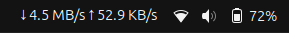

# Network Speed Monitor

Network Speed Monitor is a GNOME extension that displays the current network speed on the top bar of your Ubuntu desktop. It provides a real-time view of your download and upload speeds, helping you monitor your network usage efficiently.

## Features

- Real-time network speed monitoring
- Easy-to-read display on the top bar
- Customizable refresh interval
- Supports multiple network interfaces

## Installation

To install the Network Speed Monitor extension:

1. **Download the extension:**
   - Clone the repository to your local machine:
     ```sh
     git clone https://github.com/ajxv/netspeed-monitor.git
     ```

2. **Install the extension:**
   - Copy the extension files to the GNOME extensions directory:
     ```sh
     cp -r netspeed-monitor ~/.local/share/gnome-shell/extensions/netspeed-monitor@ajxv/
     ```

3. **Enable the extension:**
   - Open GNOME Tweaks and navigate to the Extensions tab, then enable the Network Speed Monitor extension.
   - Alternatively, you can enable the extension using the command line:
     ```sh
     gnome-extensions enable netspeed-monitor@ajxv
     ```

4. **Restart GNOME Shell:**
   - Press `Alt + F2`, type `r`, and press `Enter` to restart GNOME Shell.

## Usage

Once installed and enabled, the Network Speed Monitor extension will display the current download (↓) and upload (↑) speeds on the top bar of your Ubuntu desktop. The speeds are updated every few seconds based on the configured refresh interval.

## ScreenShot


## Contributing

Contributions are welcome to the Network Speed Monitor extension! To contribute, follow these steps:

1. **Fork the repository.**
2. **Clone your fork:**

    ```sh
    git clone https://github.com/YOUR-USERNAME/netspeed-monitor.git
    ```

3. **Create a new branch:**
    
    ```sh
    git checkout -b my-feature-branch
    ```

4. **Make your changes.**
5. **Test your changes.**
6. **Commit your changes:**

    ```sh
    git add .
    git commit -m "Description of your changes"
    ```

7. **Push your changes:**

    ```sh
    git push origin my-feature-branch
    ```

8. **Create a pull request.**

## License

This project is licensed under the [MIT License](LICENSE).

