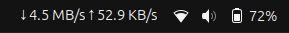

# Network Speed Monitor (GNOME Extension)

[](https://extensions.gnome.org/extension/7565/network-speed-monitor/)

This extension shows your current network download and upload speeds in the GNOME top bar. It helps you keep track of your network usage in real time.



## Features

- Shows real-time download (↓) and upload (↑) speeds
- Supports multiple network interfaces
- Excludes virtual interfaces (lo, vir, vbox, docker, br-)
- Toggle between bits and bytes display (long-press the indicator)

## Manual Installation & Try Locally


1. Clone this repository:
   ```sh
   git clone https://github.com/ajxv/netspeed-monitor.git
   ```
2. Copy the folder to your GNOME extensions directory:
   ```sh
   cp -r netspeed-monitor ~/.local/share/gnome-shell/extensions/netspeed-monitor@ajxv/
   ```
3. Compile the GSettings schema:
   ```sh
   glib-compile-schemas ~/.local/share/gnome-shell/extensions/netspeed-monitor@ajxv/schemas/
   ```
4. Restart GNOME Shell:
   - Press `Alt+F2`, type `r`, and press `Enter` (on X11), or log out and log in again.
5. Enable the extension:
   ```sh
   gnome-extensions enable netspeed-monitor@ajxv
   ```

## Contributing & Issues

- To contribute, fork this repo and open a pull request with your changes.
- For bug reports or feature requests, please open an issue on the [GitHub Issues page](https://github.com/ajxv/netspeed-monitor/issues).

## License

MIT License. See the LICENSE file for details.

