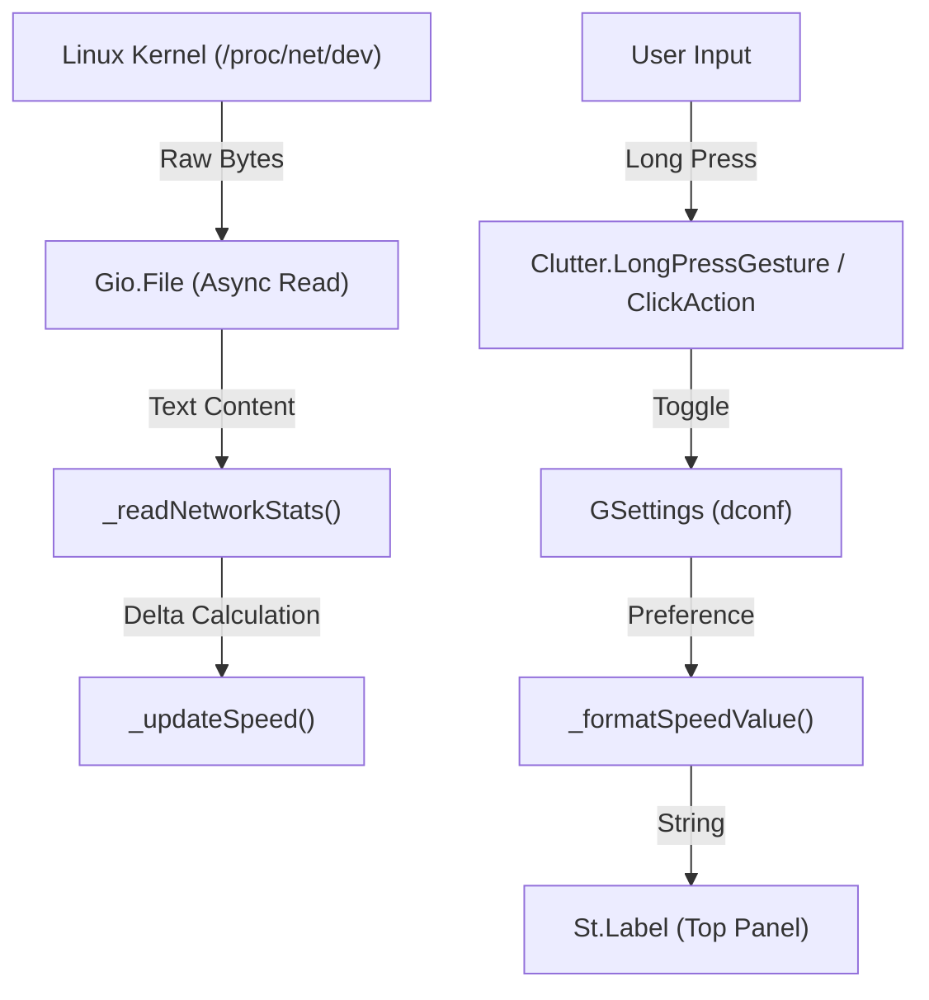

# Network Speed Monitor - Technical Documentation

## 1. Project Overview
This extension displays real-time network upload and download speeds in the GNOME Shell top panel. It is designed to be **minimal**, **resource-efficient**, and **interactive**.

### Key Features
* **Asynchronous I/O**: Reads system files without blocking the UI thread.
* **Persistent Settings**: Remembers user preferences (Bits vs Bytes) across reboots.
* **Interactive UI**: Supports a long-press (1s) action to toggle units.
* **Standard Compliance**: Uses GNOME 45+ ESM (ECMAScript Modules) architecture.

## 2. Architecture & Data Flow

The extension operates as a bridge between the Linux Kernel's network counters and the GNOME Shell UI.



---

## 3. Code Deep Dive: `extension.js`

This file contains the core logic. Below is a breakdown of every section.

### 3.1. Imports
We use GObject Introspection (`gi://`) to access C libraries from JavaScript.

* **`GObject`**: The base object system. Required to create custom GNOME widgets.
* **`St`**: "Shell Toolkit". Provides the visual text label element.
* **`GLib`**: Provides the main loop timer (heartbeat) for updates.
* **`Clutter`**: The graphics engine. Handles mouse events and layout alignment.
* **`Gio`**: Handles file input/output and persistent settings.

### 3.2. Constants
Defined at the top for easy configuration.

```javascript
const UPDATE_INTERVAL_SECONDS = 3;
const LONG_PRESS_DURATION_MS = 1000; // 1 second
const NETWORK_INTERFACES_TO_IGNORE = ['lo', 'vir', 'vbox', 'docker', 'br-'];
const PROC_NET_DEV_PATH = '/proc/net/dev';
```

* **`UPDATE_INTERVAL_SECONDS`**: Lower values make the display smoother but increase CPU usage.
* **`NETWORK_INTERFACES_TO_IGNORE`**: Filters out virtual interfaces to ensure we only show real internet traffic.
* **`PROC_NET_DEV_PATH`**: A virtual file generated by the kernel containing total bytes transmitted/received since boot.

---

### 3.3. The UI Class: `NetworkSpeedIndicator`

This class extends `St.Label`, meaning it **is** a text widget with added intelligence.

#### The Constructor (`_init`)
```javascript
_init(settings) {
    super._init({ reactive: true, ... });
    // ...
}
```
* **`reactive: true`**: Crucial. By default, labels ignore mouse events. This enables the label to receive clicks.
* **`this._netDevFile`**: We pre-load the `Gio.File` object here so we don't have to re-allocate memory for the file path every 3 seconds.

#### The Interaction Logic (Long Press)
GNOME 50 uses `Clutter.LongPressGesture`; older supported versions fall back to `Clutter.ClickAction`.

```javascript
this._clickAction = new Clutter.LongPressGesture({
    long_press_duration_ms: 1000,
});
this._clickAction.connect('recognize', toggleUnits);
```
* **Why `recognize`?**: It fires once after the configured long-press duration.

#### The Hardware Reader (`_readNetworkStats`)
This method reads `/proc/net/dev`.
* **`load_contents_async`**: File I/O can be slow. If we used synchronous reading, the entire GNOME desktop would freeze for a few milliseconds every update. Async pushes this work to a background thread.
* **The Parsing Logic**:
    1.  Skip first 2 lines (headers).
    2.  Split by `:` to separate interface name.
    3.  Check ignore list.
    4.  Parse columns 0 (RX Bytes) and 8 (TX Bytes).

#### The Math (`_formatSpeedValue`)
Handles the conversion logic based on user settings.

* **Bits Mode (`use-bits: true`)**:
    * Multiplier: `* 8` (1 Byte = 8 Bits).
    * Divider: `1000` (Networking standard: 1 kbps = 1000 bps).
    * Units: `bps`, `Kbps`, `Mbps`, `Gbps`.
* **Bytes Mode (`use-bits: false`)**:
    * Multiplier: `1` (Raw bytes).
    * Divider: `1024` (Storage standard: 1 KB = 1024 Bytes).
    * Units: `B/s`, `KB/s`, `MB/s`, `GB/s`.

---

### 3.4. The Extension Class: `NetworkSpeedExtension`

This class manages the lifecycle of the extension.

* **`enable()`**:
    * Fetches settings (`this.getSettings()`).
    * Creates the indicator.
    * Injects it into `Main.panel._rightBox`.
* **`disable()`**:
    * **Critical Step**: Calls `stopUpdate()` to kill the timer. Failing to do this causes **memory leaks**.
    * Destroys the UI element.

## 4. Settings & Persistence (Schemas)

The extension uses `GSettings` (via dconf) to save the Bits/Bytes preference.

### `metadata.json`
```json
{
  "uuid": "netspeed-monitor@ajxv",
  "settings-schema": "org.gnome.shell.extensions.netspeed-monitor"
}
```
* **`uuid`**: Links the code to the installation folder.
* **`settings-schema`**: Tells GNOME which schema ID to load when `this.getSettings()` is called.

### `schemas/...gschema.xml`
* **File Location**: `schemas/org.gnome.shell.extensions.netspeed-monitor.gschema.xml`
* **ID Match**: The `<schema id="...">` inside the XML **must** match the filename and the `metadata.json` entry.
* **Path**: `/org/gnome/shell/extensions/netspeed-monitor/` defines the "folder" in the dconf database where the variable is stored.

## 5. Customization Guide

### How to Change the Update Speed
Modify the `UPDATE_INTERVAL_SECONDS` constant near the top of `extension.js`:
```javascript
const UPDATE_INTERVAL_SECONDS = 3; // Change to 1 for faster updates
```

### How to Change the Long Press Duration
Modify the `LONG_PRESS_DURATION_MS` constant near the top of `extension.js`:
```javascript
const LONG_PRESS_DURATION_MS = 1000; // Change to 2000 for 2 seconds
```

## 6. Troubleshooting

### Settings not saving
* **Cause**: Schema mismatch or schemas not compiled.
* **Fix**: Ensure `metadata.json` schema ID matches the XML ID exactly. Run this command inside the extension directory:
    ```bash
    glib-compile-schemas schemas/
    ```
